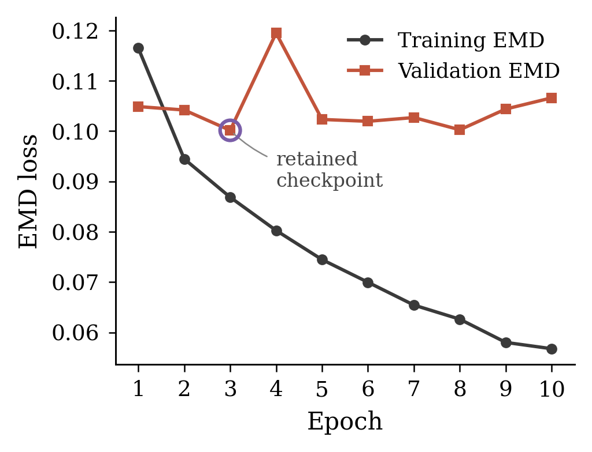
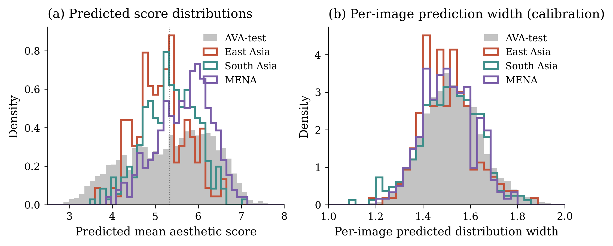
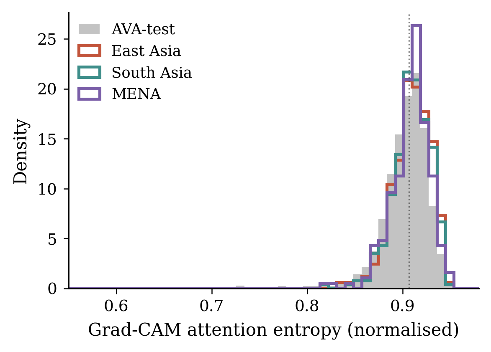
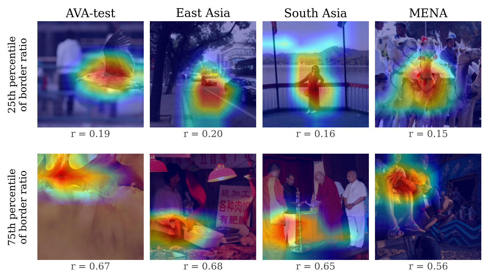

<h1 align="center">Diagnosing Cultural Bias in AVA Trained Aesthetic Scoring</h1>

<p align="center">
  <b>A Ground Truth Free Framework for Cross Cultural Evaluation of Deep Learning Based Image Aesthetic Assessment</b>
</p>

<p align="center">
  
  
  
  
  
  
  
</p>

<p align="center">
  
</p>

<p align="center">
  <i>A ResNet18 aesthetic model is fine tuned on AVA, frozen, and used as a fixed instrument to study how it behaves on 687 curated non Western photographs.</i>
</p>

---

## Research at a Glance

<div align="center">

| 188K+ | 687 | 3 | 4 | ResNet18 |
|:---:|:---:|:---:|:---:|:---:|
| Candidate images processed | Curated benchmark images | Cultural regions | Behavioral metrics | NIMA backbone |

</div>

---

## Contents

1. [Abstract](#abstract)
2. [Why This Matters](#why-this-matters)
3. [Key Contributions](#key-contributions)
4. [Repository Structure](#repository-structure)
5. [Dataset](#dataset)
6. [Methodology](#methodology)
7. [Results](#results)
8. [Key Findings](#key-findings)
9. [How to Run](#how-to-run)
10. [Trained Model](#trained-model)
11. [Reproducibility Checklist](#reproducibility-checklist)
12. [Paper](#paper)
13. [Limitations](#limitations)
14. [Future Work](#future-work)
15. [Citation](#citation)
16. [Acknowledgements](#acknowledgements)
17. [Contact](#contact)
18. [License](#license)

---

## Abstract

Image aesthetic assessment models are trained almost exclusively on Western centric datasets such as AVA. They reach strong benchmark numbers, yet how they behave on photographs from other cultural regions stays largely untested. The obstacle is simple. Non Western imagery has no ground truth aesthetic labels, so accuracy cannot be measured.

This project takes a different route and measures behavior instead of accuracy. A ResNet18 aesthetic regressor is fine tuned on AVA, frozen, and run as a fixed instrument on 687 curated photographs from three regions (East Asia, South Asia, and the Middle East and North Africa). The frozen model is studied along three axes: shifts in predicted score distributions, per image prediction confidence, and spatial attention through Grad CAM. Predicted scores shift and compress, confidence stays flat, and attention grows more diffuse. The model hedges on non Western content without signaling any rise in uncertainty.

---

## Why This Matters

Aesthetic models can look objective. A single number comes out, and it feels neutral. The number is not neutral. It is learned from one specific community of photographers and raters (AVA comes from a single online contest site), with its own conventions of composition, color, framing, and subject matter.

When such a model is deployed worldwide, in image search, photo culling, recommendation, or creative tools, it carries those conventions with it. The risk is quiet. The model may score non Western photographs differently while showing no sign that it is on unfamiliar ground. There is no warning and no spike in uncertainty, just a shifted score that looks as confident as any other.

This project was built to detect exactly that quiet failure mode, using only the model's own behavior and no external labels.

---

## Key Contributions

✅ A ground truth free diagnostic framework for cultural bias in aesthetic models.

✅ A ResNet18 NIMA aesthetic regressor, fine tuned on AVA and frozen as a fixed measuring instrument.

✅ Three independently collected, openly licensed non Western photographic benchmarks.

✅ A fully automated Wikimedia Commons scraping and filtering pipeline.

✅ Complete provenance and rejection logs for every curated image.

✅ Distribution shift, prediction confidence, and Grad CAM attention diagnostics.

✅ Statistically significant behavioral shifts demonstrated across all three regions.

---

## Repository Structure

```text
data/
  ava/                  # AVA metadata (images not redistributed)
  nonwestern_dataset/   # curated benchmark across 3 regions

models/
  checkpoints/          # resnet18_ava_best.pt

outputs/
  figures/
    paper_figures/      # figures used in the paper
    extra_figures/      # additional plots
  logs/
    predictions/        # per image predictions
    metrics/            # computed metric tables
    summaries/          # summary statistics
    training/           # training and validation logs

src/
  training/             # train and evaluate on AVA
  analysis/             # inference, distribution shift, Grad CAM
  visualization/        # figure generation

paper/                  # manuscript and references
```

---

## Dataset

### Training Data: AVA

The model is trained on the Aesthetic Visual Analysis (AVA) dataset. Each image carries a distribution of human aesthetic ratings on a 1 to 10 scale.

A reproducible subset of **23,198** images was sampled under a fixed seed, stratified across ten equal width bins of mean score. Stratification matters because AVA scores cluster near the middle, so the sparse low and high bins were kept in full while the well populated middle bins were subsampled. The subset was split 80 / 10 / 10 into training (18,558), validation (2,319), and test (2,321).

| Dataset | Images | Note |
|:--------|------:|:-----|
| AVA subset | 23,198 | Metadata included in this repository |

The original AVA images are not redistributed here, due to licensing and storage limits. Only the metadata is included.

### Non Western Evaluation Data

The non Western benchmark was independently collected from Wikimedia Commons for this research. To keep the medium constant with AVA, only photographs were kept. Paintings, illustrations, maps, and other non photographic media were excluded.

The collection pipeline runs as follows:

* Recursive traversal of 17 seed categories to a depth of two subcategory levels.
* Automatic category filtering that skips branches such as "in art," "map," "logo," "painting," and "sculpture."
* Format filtering (JPEG and PNG only) and resolution filtering (minimum 600 pixels on the shorter edge).
* License verification (Creative Commons or public domain only, so the set can be openly redistributed).
* Duplicate removal and manual quality inspection.
* Provenance logging of source category, originating URL, license, and curation decision for every image.

Starting from roughly **188,000** candidate file entries (39,426 East Asia, 114,435 South Asia, 34,148 MENA), automatic filtering plus a per region cap produced 1,500 images for manual review, of which **687** were kept.

| Region | Images |
|:-------|------:|
| East Asia | 186 |
| South Asia | 289 |
| Middle East and North Africa (MENA) | 212 |
| **Total** | **687** |

The differing retention rates across regions (37 percent East Asia, 58 percent South Asia, 42 percent MENA) reflect real differences in the subject composition of open licensed photography for each region.

---

## Methodology

The frozen model is treated as a fixed instrument. The contribution is what its behavior reveals, not the model itself.

1. **Train.** Fine tune a ResNet18 (ImageNet pretrained, NIMA style 10 unit softmax head) on the AVA subset with Earth Mover's Distance loss.
2. **Freeze.** Keep the checkpoint with the lowest validation loss and never change it again.
3. **Infer.** Run the frozen model on the held out AVA test set and on all three non Western sets.
4. **Compare distributions.** Test predicted score distributions against AVA test using the Kolmogorov Smirnov statistic and the Wasserstein distance.
5. **Compare confidence.** Measure per image prediction spread (the standard deviation of each predicted score distribution).
6. **Attend.** Generate Grad CAM heatmaps on the final convolutional layer, with the predicted mean score as the target.
7. **Quantify attention.** Compute two metrics per image, attention entropy (how decisively the model attends) and the border to centre ratio (where the model attends).

These steps span **three diagnostic axes** (score distribution, prediction confidence, spatial attention) measured through **four metrics** in total.

<details>
<summary><b>Training configuration</b></summary>

<br>

| Setting | Value |
|:--------|:------|
| Backbone | ResNet18, ImageNet pretrained |
| Head | 10 unit linear plus softmax (predicts a 1 to 10 score distribution) |
| Loss | Earth Mover's Distance (EMD) |
| Optimizer | Adam |
| Learning rate | 0.0001 backbone, 0.001 head |
| Weight decay | 0.00001 |
| Batch size | 128 |
| Precision | Mixed precision (fp16) |
| Input | 224 by 224, ImageNet normalization |
| Augmentation | Random crop (scale 0.7 to 1.0) and horizontal flip during training |
| Epochs | 10, best validation checkpoint kept |
| Hardware | NVIDIA RTX A5000 |

</details>

---

## Results

> **Headline.** Predicted scores shift and compress, attention spreads out, and confidence does not move. The model becomes confidently conservative on non Western photographs, hedging its judgments without ever signaling that it is on unfamiliar ground.

### Instrument validity on AVA

On the held out AVA test set (2,321 images) the frozen checkpoint reaches a Spearman correlation of 0.733 and a Pearson correlation of 0.731 between predicted and ground truth mean scores, with an EMD loss of 0.102 and a mean absolute error of 0.679. These values sit comfortably in the range reported for NIMA style models, which confirms the instrument is competent before it is pointed at anything else.

<p align="center">
  
</p>

<p align="center">
  <i>Training and validation EMD loss across 10 epochs. Validation loss bottoms out at epoch 3 and rises mildly afterward, so the epoch 3 checkpoint is frozen as the instrument.</i>
</p>

### Predicted score distributions

<p align="center">
  
</p>

<p align="center">
  <i>Predicted mean scores (left) and per image prediction width (right). The three non Western regions sit visibly narrower than AVA and shift in different directions, while their prediction widths overlap heavily with AVA.</i>
</p>

All three regions differ from AVA test at very high significance (p below 0.000001 in every case). Regional means move in different directions (East Asia 5.15, South Asia 5.35, MENA 5.68, against 5.34 on AVA), yet every region is far narrower than AVA (predicted standard deviation 0.59 to 0.62, against 0.99). The model rarely predicts extreme scores on non Western photographs.

### Attention entropy

<p align="center">
  
</p>

<p align="center">
  <i>Distribution of normalized Grad CAM attention entropy per image. AVA spans the full range from sharply focused to highly diffuse. All three non Western regions cluster in a narrow band of moderately diffuse attention.</i>
</p>

Attention entropy is higher and far more tightly clustered on non Western sets. AVA entropy varies widely across images (standard deviation 0.077), whereas the non Western entropies sit in a narrow band (standard deviation 0.019 to 0.020). The model loses its full range of attention behaviors and settles into a moderately diffuse pattern.

### Grad CAM overlays

<p align="center">
  
</p>

<p align="center">
  <i>Grad CAM overlays for representative images per group. AVA heatmaps range from tightly focused on a clear subject to diffuse. Non Western heatmaps tend to occupy a narrower, more diffuse band. On photographs with multiple subjects or non standard composition, the model defaults to the centre of the frame rather than the meaningful subject.</i>
</p>

<details>
<summary><b>Detailed diagnostics (numbers)</b></summary>

<br>

**Distribution shift relative to AVA test.** KS is the two sample Kolmogorov Smirnov statistic, W is the Wasserstein distance.

| Region | KS | p | W |
|:-------|---:|:--:|---:|
| East Asia | 0.231 | < 0.000001 | 0.41 |
| South Asia | 0.172 | < 0.000001 | 0.34 |
| MENA | 0.232 | < 0.000001 | 0.40 |

**Prediction width (confidence).** Per image prediction spread barely moves (means 1.50 to 1.51, against 1.53 on AVA). A mild calibration shift appears only for East Asia.

| Region | KS | p |
|:-------|---:|:--:|
| East Asia | 0.129 | 0.006 |
| South Asia | 0.058 | 0.34 |
| MENA | 0.081 | 0.15 |

**Spatial attention.** Border ratio values use the upper 5 percent trimmed per group. Entropy is the normalized Shannon entropy of the heatmap.

| Region | Border ratio KS | Border ratio p | Entropy KS | Entropy p |
|:-------|---:|:--:|---:|:--:|
| East Asia | 0.073 | 0.31 | 0.129 | 0.006 |
| South Asia | 0.076 | 0.094 | 0.117 | 0.002 |
| MENA | 0.106 | 0.024 | 0.116 | 0.009 |

</details>

---

## Key Findings

| Observation | Finding |
|:------------|:--------|
| Score distribution | Significant regional shifts in different directions |
| Prediction range | Compressed on every evaluation set |
| Prediction confidence | Largely unchanged |
| Grad CAM entropy | Consistently more diffuse |
| Border to centre ratio | Significant only for MENA |

The combination is the point. Shifted, compressed scores and more diffuse attention, with no matching rise in uncertainty, is the kind of behavior that ordinary in distribution accuracy would never surface.

---

## How to Run

Adjust the script paths below to match your local layout.

<details>
<summary><b>1. Install</b></summary>

<br>

```bash
git clone https://github.com/<your-username>/cultural-bias-aesthetic-scoring.git
cd cultural-bias-aesthetic-scoring
pip install -r requirements.txt
```

</details>

<details>
<summary><b>2. Prepare AVA</b></summary>

<br>

```bash
python src/training/prepare_ava.py
```

</details>

<details>
<summary><b>3. Train the model</b></summary>

<br>

```bash
python src/training/train_ava.py
```

</details>

<details>
<summary><b>4. Evaluate on AVA test</b></summary>

<br>

```bash
python src/training/eval_ava_test.py
```

</details>

<details>
<summary><b>5. Run non Western inference</b></summary>

<br>

```bash
python src/analysis/inference_nonwestern.py
```

</details>

<details>
<summary><b>6. Run distribution analysis</b></summary>

<br>

```bash
python src/analysis/dist_shift_analysis.py
```

</details>

<details>
<summary><b>7. Run Grad CAM analysis</b></summary>

<br>

```bash
python src/analysis/gradcam_analysis.py
```

</details>

<details>
<summary><b>8. Generate figures</b></summary>

<br>

```bash
python src/visualization/make_figures.py
```

</details>

---

## Trained Model

The repository includes the best performing checkpoint.

```text
models/checkpoints/resnet18_ava_best.pt   (42.7 MB)
```

This is the epoch 3 checkpoint, frozen and used for every analysis in the paper.

---

## Reproducibility Checklist

| | Item |
|:--:|:-----|
| ✅ | Source code |
| ✅ | Trained checkpoint (42.7 MB) |
| ✅ | AVA metadata |
| ✅ | Full image provenance and rejection logs |
| ✅ | Prediction, metric, and training logs |
| ✅ | All paper figures |
| ✅ | Paper source and PDF |

---

## Paper

```text
paper/AICT_2026_CULTURAL_BIAS_IN_AESTHETICS.pdf    # compiled paper
```
---

## Limitations

* **No human ground truth ratings** exist for the non Western sets, so this study diagnoses behavior, not accuracy. It can show that predictions differ from AVA, not that they are wrong in an absolute sense.
* **A single architecture and a single training set.** Only ResNet18 trained on AVA is studied. The framework itself is architecture agnostic.
* **Broad regional groupings and modest sizes** (186 to 289 images per region). East Asia is dominated by China, South Asia by India, and MENA by Egypt and Morocco. The results should not be read as describing the aesthetics of entire continents.
* **Subject matter is a possible confound.** The regional sets differ in what is photographed, so some of the mean differences may reflect content rather than a pure cultural aesthetic effect.
* **The border to centre metric is weak** (significant only for MENA). The spatial finding rests mainly on attention entropy.

---

## Future Work

* Apply the framework to ResNet50, EfficientNet, and Vision Transformers to test whether the compression and diffusion pattern is specific to ResNet18.
* Repeat on models trained on AADB or PARA to see whether the bias is AVA specific or shared across Western centric aesthetics datasets.
* Add finer per country analysis and currently under represented regions (the South Caucasus, Central Asia, sub Saharan Africa).
* Run a human rating study with raters drawn from both Western and the relevant regional communities.
* Use the framework as an evaluation substrate for debiasing methods, measuring whether they push the diagnostic axes back toward the AVA reference.

---

## Citation

```bibtex
@inproceedings{aghayeva2026culturalbias,
  title   = {Diagnosing Cultural Bias in AVA Trained Aesthetic Scoring: A Ground Truth Free Framework},
  author  = {Aghayeva, Nargiz},
  year    = {2026}
}
```

---

## Acknowledgements

This work was conducted at ADA University. The author thanks the CeDAR Laboratory for computational resources and technical support, and the administration team for troubleshooting support.

---

## Contact

**Nargiz Aghayeva**

School of Information Technologies and Engineering, ADA University, Baku, Azerbaijan

Email: [nargizkaghayeva@gmail.com](mailto:nargizkaghayeva@gmail.com)

---

## License

Released under the MIT License. The curated non Western image set is redistributed under the Creative Commons and public domain licenses of its source files, with full provenance recorded in the dataset logs.
